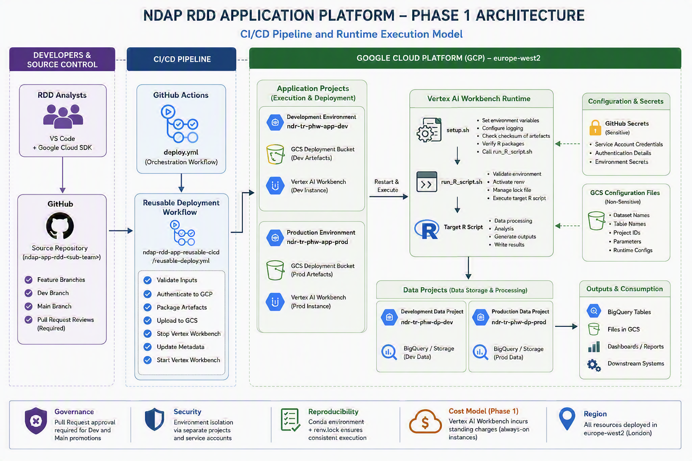

# NDAP CI/CD Process Overview

## Operating Model

**Version:** 2.0  
**Status:** Current State (Phase 1) with Future State (Phase 2) Roadmap  
**Platform:** Google Cloud Platform (GCP)  
**Primary Language:** R  
**Region:** europe-west2 (London)  
**Source Control:** GitHub  

---

## Executive Summary

The NDAP Research and Development Directorate (RDD) Application Platform provides a standardised Continuous Integration and Continuous Deployment (CI/CD) framework for the development, testing, deployment and execution of R-based analytical workloads on Google Cloud Platform (GCP).

The platform enables analytical teams to focus on developing business logic and statistical methodology whilst deployment, runtime orchestration and infrastructure management are increasingly standardised and automated.

The current Phase 1 implementation provides:

- Standardised GitHub repository structures
- Automated CI/CD pipelines
- Controlled promotion through Development and Production environments
- Reproducible R environments through `renv`
- Automated deployment using GitHub Actions
- Runtime execution through Vertex AI Workbench
- Configuration-driven deployments
- Shared reusable deployment workflows

The future Phase 2 evolution transitions the platform towards a centrally managed Platform Engineering model built around:

- Containerisation
- Artifact Registry
- Cloud Run Jobs
- Cloud Scheduler
- Workload Identity Federation
- Golden runtime images
- Thin application repositories

This transition will significantly reduce operational overhead, minimise platform drift, improve scalability and reduce infrastructure costs through a fully serverless, pay-per-use architecture.

---

## Business Context

Multiple RDD teams develop and operate analytical products that transform, process and publish public health data.

Historically, analytical applications have required bespoke deployment approaches, operational processes and runtime environments. This creates challenges around:

- Consistency
- Reproducibility
- Supportability
- Security
- Cost optimisation

The NDAP RDD CI/CD Platform addresses these challenges through the introduction of a common deployment architecture that can be reused across all analytical teams.

Examples include:

- RDD PHOF
- RDD PCC
- RDD SHRN
- Future RDD analytical teams

---

## Architecture Objectives

The platform has been designed to achieve the following objectives.

**Standardisation**

Enable all RDD teams to follow a common deployment pattern.

**Automation**

Eliminate manual deployment activities wherever possible.

**Security**

Provide controlled access, environment segregation and secure deployment pathways.

**Reproducibility**

Ensure analytical code executes consistently between environments.

**Scalability**

Allow new teams to onboard without creating new infrastructure patterns.

**Cost Efficiency**

Reduce operational costs through shared architecture and reusable tooling.

**Maintainability**

Centralise common functionality and minimise duplicated engineering effort.

---

## Architectural Principles

**Principle 1 — Everything is Version Controlled**

All application code, workflow definitions and deployment artefacts originate from Git repositories.

---

**Principle 2 — Production Must Be Earned**

Every deployment must progress through controlled promotion stages before reaching Production.

---

**Principle 3 — Automate Everything Possible**

Deployments, validation steps and runtime provisioning should be automated wherever practical.

---

**Principle 4 — Shared Components Belong to the Platform**

Common deployment functionality should be centrally maintained rather than duplicated across repositories.

---

**Principle 5 — Runtime Environments Must Be Reproducible**

Applications should execute using deterministic runtime configurations.

---

**Principle 6 — Isolation Reduces Risk**

Workloads should be separated wherever possible to minimise blast radius.

---

## Platform Architecture Overview

### Environment Architecture

#### Regional Deployment

All environments are deployed within: GCP Region **europe-west2(London)**

#### Projects

GCP projects are divided in two planes: Application & Data, which are further divided into two environments: Development & Production

##### Application Projects

ndr-tr-phw-app-dev (Development)

ndr-tr-phw-app-prod (Production)

**Responsibilities include**:

- Deployment artefacts
- Runtime execution
- Vertex AI infrastructure
- Application orchestration

---

##### Data Projects

ndr-tr-phw-dp-dev (Development)

ndr-tr-phw-dp-prod (Production)

**Responsibilities include**:

- Dataset storage
- Table management
- Data processing
- Analytical outputs

---

##### Benefits of Segregation b/w application & data

**Reduced Blast Radius**

Compromise or failure of application services does not automatically compromise data storage environments.

**Improved Security**

Different IAM policies may be applied to application and data layers.

**Operational Isolation**

Application changes can occur independently of data platform changes.

**Governance**

Improves auditing and ownership of platform components.

---

## Repository Naming Convention

Repositories follow a common naming convention.

ndap-app-rdd-**repo or team name**

Examples:

ndap-app-rdd-phof

ndap-app-rdd-pcc

ndap-app-rdd-shrn

This enables consistency and discoverability across the platform.

---

## Branching Strategy

The platform follows a simple promotion model.

feature/*
      |
      v
     dev
      |
      v
    main

---

### Feature Branch

Used for:

- Development
- Bug fixes
- Enhancements
- Refactoring

Examples:

feature/new-indicator
feature/refactor-processing
feature/bug-fix

---

### Development Branch

Purpose:

- Integration testing
- System testing
- End-to-end validation

Deployment Target:

ndr-tr-phw-app-dev

---

### Main Branch

Purpose:

- Production releases

Deployment Target:

ndr-tr-phw-app-prod

---

### Pull Request Governance

Pull Requests are mandatory for branch promotion.

#### Feature → Dev

Requirements:

- Peer review
- Pull Request approval
- Successful deployment
- Validation of outputs

---

#### Dev → Main

Requirements:

- Peer review
- Pull Request approval
- Successful development validation
- Release acceptance

---

## Development Lifecycle

**Step 1 – Build**

Analysts develop R code using:

- Visual Studio Code
- Google Cloud SDK
- Development GCP resources

---
**Step 2 – Commit**

Changes are committed into a feature branch.

---

**Step 3 – Review**

Pull Request raised into Dev branch.

---

**Step 4 – Deploy to Development**

CI/CD pipeline automatically deploys the solution.

---

**Step 5 – Validate**

Outputs are reviewed and validated.

Validation approaches vary by team:

- Full E2E runs
- Workflow dispatch controlled runs
- Targeted validation activities

---

**Step 6 – Promote to Production**

Changes are promoted through a Pull Request into Main.

---

**Step 7 – Deploy to Production**

Automated deployment executes against Production resources.

---

## CI/CD Process Diagram

The CI/CD framework consists of:

### Application Repository

Owns:

- Business logic
- R code
- Configuration
- Package requirements

---

### Shared Platform Repository

Repository:

Public-Health-Wales/ndap-rdd-app-reusable-cicd

Owns:

- Deployment logic
- Runtime orchestration
- Common CI/CD activities

This prevents duplication across analytical teams.

---

## Deployment Workflow

### deploy.yml

Acts as the orchestration layer.

Capabilities:

- Automated deployment
- Workflow dispatch
- Environment selection
- Secret management
- Reusable workflow invocation

---

### Environment Selection

main -> Production

all other deployment branches -> Development

---

### Secret Selection

Environment-specific GitHub Secrets are automatically passed to the shared deployment workflow.

---

### Shared Deployment Workflow

Repository:

ndap-rdd-app-reusable-cicd

Workflow:

reusable-deploy.yml

### Sequence of Events

Validate Inputs
       |
Authenticate
       |
Package Artefacts
       |
Upload Artefacts
       |
Stop Vertex Instance
       |
Update Metadata
       |
Restart Vertex Instance
       |
Trigger Runtime

---

### Runtime Execution Sequence (File Level)

Execution begins after the Vertex instance starts.

Vertex Startup
      |
      v
setup.sh
      |
      v
run_R_script.sh
      |
      v
Target R Script

---

#### setup.sh Responsibilities

The startup script performs infrastructure validation.

Responsibilities:

- Configure environment variables
- Initialise logging
- Validate artefact checksums
- Verify package existence
- Launch execution pipeline

Calls:

bash run_R_script.sh

---

#### run_R_script.sh Responsibilities

Responsible for runtime control.

Functions include:

- Environment verification
- renv activation
- Lock file management
- R script invocation

---

#### generate_lock.sh Responsibilities

Responsible for dependency management.

Activities:

- Verify Conda environment
- Create environment if missing
- Install dependencies from packages.txt
- Generate renv.lock

This guarantees reproducible package versions.

---

### Configuration Management

#### Sensitive Configuration

Stored in: GitHub Secrets

Examples:

- Service account credentials
- Authentication secrets

---

#### Non-Sensitive Configuration

Stored within GCS-hosted configuration files.

Examples:

- Dataset names
- Table names
- Bucket names
- Project names

Benefits:

- Environment portability
- Reduced code changes
- Easier operational management

---

### Security Controls

**Mandatory Peer Review**: 

Required at:

Feature -> Dev
Dev -> Main

---

**Environment Isolation**: 

Development and Production operate independently.

---

**Credential Segregation**: 

Each environment uses dedicated credentials.

---

**Controlled Deployment Path**: 

Production deployments must originate from approved source-controlled changes.

---

**Project Segregation**: 

Application and data projects remain logically separated.

---

## Multi-Team Operating Model

The architecture is intentionally replicated across RDD teams.

Benefits:

- Consistent platform experience
- Reduced support complexity
- Standard onboarding process
- Shared operational tooling

---

## Current State Assessment (Phase 1)

The current architecture successfully delivers:

- Automated deployments
- Reproducible execution
- Shared deployment workflows
- Controlled environment promotion
- Reusable CI/CD capabilities

However, several challenges remain.

**Increased Duplication & Complexity**: 

Nearly all the scripts in CI/CD process are replicated in each team's deployment pipeline, resulting in significant duplication, complexity and forcing analysts/scientists to undertake engineering maintenance activities.

---

**Infrastructure Cost**: 

Vertex AI Workbench incurs standing infrastructure costs even when workloads are not running.

---

**Runtime Management Complexity**: 

Workbench lifecycle management introduces operational overhead.

---

**Shared Runtime Risks**:

Multiple workloads can execute on a shared runtime environment.

This increases potential blast radius.

---

## Target State Architecture (Phase 2)

The strategic direction for the platform is a move towards a Platform Engineering operating model.

### Vision

Analytical teams should focus exclusively on:

- Business logic
- Statistical methodology
- Data transformation

The platform should own:

- Runtime management
- Container builds
- Deployment orchestration
- Dependency management
- Security controls

---

### Phase 2 Platform Model

Refer to [NDAP Proposed Architecture](architecture.md)

---

**Thin Repository**:

Application repositories will contain only:

Application Code
workflow.yml
packages.txt
Configuration

All deployment logic will reside centrally.

Benefits:

- **Plug-and-play onboarding**
- **Minimal duplication**
- **Simplified maintenance**
- **Consistent standards**

---

**Golden Runtime Images**: 

The platform will maintain approved base images.

Examples:

R 4.4 Base Image
R 4.5 Base Image

These images will include:

- Approved R versions
- Approved package baselines
- Common platform tooling

Stored within:

Artifact Registry

Benefits:

- **Zero Runtime Drift**: Development and Production execute identical images.
- **Consistent Package Versions**: Eliminates environment inconsistencies.
- **Faster Deployments**: Common packages no longer require installation during execution.
- **Simplified Support**: One known runtime baseline.

---

### Cloud Run Execution Model

Phase 2 replaces long-lived runtime infrastructure with ephemeral execution.

Container Starts
       |
Execute Workload
       |
Container Stops

Benefits:

- **Pay-Per-Use**: Only pay when workloads execute.
- **No Standing Charges**: No idle infrastructure costs.
- **Better Cost Efficiency**: Ideal for scheduled analytical workloads.
- **Automatic Scaling**: Supports platform growth without infrastructure redesign.

---

### Share-Nothing Architecture

Each workload executes independently.

Workload A
     |
Container A

Workload B
     |
Container B

Workload C
     |
Container C

---

Benefits:

- **Minimal Blast Radius**: Failure impacts only the affected workload.
- **Improved Reliability**: No shared runtime contamination.
- **Better Isolation**: Applications execute independently.
- **Predictable Behaviour**: Every run starts from a clean environment.

---

### Immutable Deployments

Container images become versioned deployment artefacts.

Benefits:

- **Improved auditability**
- **Easier rollback**
- **Predictable releases**

---

### Strategic Outcome

Phase 1 standardised how analytical applications are deployed.

Phase 2 standardises the platform itself.

The future operating model removes infrastructure concerns from analytical teams and provides a centrally managed, reusable and cost-efficient platform.

Analysts focus solely on analytical code.

The platform provides:

- Deployment
- Security
- Runtime management
- Dependency management
- Monitoring
- Scaling
- Governance

This results in a modern, cloud-native analytical platform that is easier to operate, cheaper to run, faster to scale and significantly more resilient than the current state.
