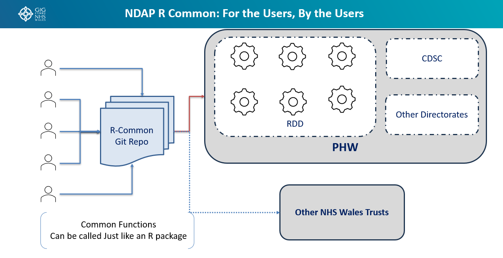

# NDAP R Common: For the Users, By the Users

## Overview

**NDAP R Common** is a community-driven repository of reusable R functions, utilities, and code components designed to be shared across Public Health Wales (PHW) and the wider NHS Wales community.

The initiative follows a simple principle:

> **Write once, use many times.**

Instead of multiple teams independently developing similar functions, common solutions can be developed collaboratively, stored centrally, and reused across projects, directorates, and organisations.

This approach helps reduce duplication, improve consistency, accelerate delivery, and foster a stronger data and analytics community.

---

# Vision

To create a shared ecosystem of reusable R code where analysts, data scientists, and developers contribute and consume common functions in the same way they use an R package.

The goal is to:

- Break down organisational silos
- Encourage collaboration
- Promote code reuse
- Improve quality through peer contribution
- Reduce development effort across teams
- Establish common standards and approaches

---

# Core Concept

NDAP R Common operates as a central Git repository that acts as a library of reusable functions and code modules.

Contributors from across PHW can publish common functionality that has value beyond a single project.

Examples include:

- Data cleaning functions
- Validation routines
- NHS Wales lookup functions
- Statistical utilities
- Reporting helpers
- Visualisation templates
- Data quality checks
- Geospatial functions
- API connectors
- Common ETL components

Once published, other teams can call these functions directly without needing to rewrite them.



---

# How It Works

## Contribute

Users and teams contribute reusable code into the R Common repository.

Examples:

- RDD analytical teams
- CDSC teams
- Other PHW directorates
- Platform engineering teams
- NHS Wales partner organisations

Each contribution is reviewed and incorporated into the shared library.

## Publish

Functions are stored in a structured Git repository with:

- Documentation
- Version control
- Coding standards
- Example usage
- Testing where applicable

This ensures contributions remain reliable and maintainable.

## Consume

Users can access and utilise shared functions just as they would any other R package.

For analysts, the experience is familiar:

```r
library(ndaprcommon)

clean_nhs_postcode(data)
validate_welsh_lhb(code)
generate_standard_report(dataset)
```

Consumers focus on solving business problems rather than rebuilding common functionality.

---

# Breaking the Silo Mentality

Historically, many teams solve the same problems independently:

- Multiple postcode cleaning functions
- Multiple validation scripts
- Multiple report-generation routines
- Multiple implementations of identical business logic

This results in:

- Duplicate effort
- Inconsistent outputs
- Higher maintenance costs
- Limited visibility of good work

NDAP R Common changes this model by creating a shared platform where innovations developed by one team can benefit everyone.

**One team's solution becomes everyone's asset.**

---

# Benefits

## Accelerated Delivery

Teams can leverage existing solutions instead of starting from scratch.

### Outcome

- Faster project delivery
- Reduced development effort
- Increased productivity

---

## Improved Quality

Shared functions are:

- Reviewed
- Reused
- Tested by multiple teams

This naturally improves code quality and reliability.

### Outcome

- Fewer defects
- Better maintainability
- Greater confidence in analytical outputs

---

## Consistency Across PHW

Common functions lead to common approaches.

Examples:

- Standardised calculations
- Consistent data cleansing
- Shared validation logic
- Unified reporting methods

### Outcome

Different teams produce consistent and comparable outputs.

---

## Knowledge Sharing

The repository becomes a living catalogue of analytical expertise.

### Outcome

- Reduced knowledge silos
- Wider adoption of best practices
- Increased cross-directorate collaboration

---

## Community-Led Innovation

The repository is developed *for the users, by the users*.

Contributors are not limited to a central development team.

Every analyst, developer, and data scientist can contribute improvements and new capabilities.

### Outcome

The platform continuously evolves based on real user needs.

---

# PHW and NHS Wales Collaboration

While initially focused on Public Health Wales, the model can extend beyond departmental boundaries.

## Public Health Wales

Contributions and consumption can come from:

- RDD
- CDSC
- Screening Programmes
- Corporate Services
- Other Directorates

## Wider NHS Wales

The shared repository can also support:

- Health Boards
- NHS Trusts
- National Programmes
- Partner Organisations

This creates opportunities for broader collaboration and standardisation across Wales.

---

# Governance Principles

To ensure sustainability, contributions should adhere to agreed standards.

## Code Standards

- Documented functions
- Clear naming conventions
- Reusable design
- Peer-reviewed changes

## Quality Assurance

- Testing where appropriate
- Version-controlled releases
- Change history
- Backward compatibility considerations

## Ownership

While governance provides oversight, ownership remains community-driven.

The success of NDAP R Common depends on active participation from its users.

---

# Expected Outcomes

By adopting NDAP R Common, Public Health Wales can:

- Eliminate unnecessary duplication of effort
- Accelerate analytics development
- Improve code quality and consistency
- Foster a culture of collaboration
- Share expertise across organisational boundaries
- Establish reusable analytics building blocks
- Create a sustainable community of practice

---

# Summary

NDAP R Common is more than a code repository—it is a collaborative framework for knowledge sharing and reusable analytics development.

By enabling teams to contribute and consume common R functions through a shared repository, the platform promotes standardisation, reduces duplicated effort, and helps build a connected analytics community across Public Health Wales and NHS Wales.

**For the Users, By the Users.**

**Share once. Reuse everywhere. Reinvent nothing.**