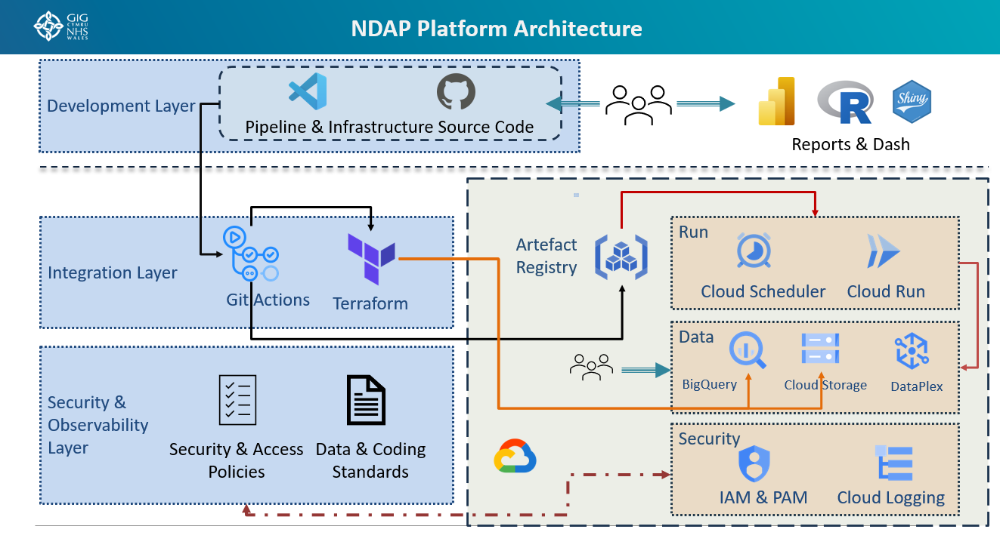

# NDAP Platform Architecture Overview

## Introduction

The NDAP (National Data Analytics Platform) architecture is designed as a cloud-native, automated, and governed analytics platform built on Google Cloud Platform (GCP). The architecture emphasizes Infrastructure as Code (IaC), DevOps automation, secure data management, and self-service analytics through modern reporting tools.

The proposed high level architecture of NDAP is pictured below:

## Platform Layers

The platform is organized into four logical layers:

1. Development Layer
2. Integration Layer
3. Security & Observability Layer
4. Google Cloud Platform Runtime Environment

---

### Development Layer

The Development Layer provides the foundation for collaborative software development, infrastructure management, and analytics enablement.

#### Components

##### Source Code Repository

The platform source code is maintained using:

- GitHub
- Visual Studio Code (VS Code)

This repository contains:

- Data pipeline code
- Infrastructure-as-Code definitions
- Deployment configurations
- Scheduling definitions
- Analytics application code

##### Consumer Analytics Layer

Business users consume analytical outputs through:

- Microsoft Power BI
- R
- Shiny Applications

These tools provide dashboards, reports, and advanced analytical capabilities based on data processed within the NDAP platform.

#### Key Benefits

- Version-controlled development
- Collaborative engineering workflows
- Automated deployment pipelines
- Traceability and auditability
- Support for both analysts and technical users

---

### Integration Layer

The Integration Layer automates platform provisioning, application deployment, and operational workflows.

#### Components

This layer is made up of the below components:

##### GitHub Actions

GitHub Actions serves as the Continuous Integration / Continuous Deployment (CI/CD) engine.

###### Responsibilities

- Code validation
- Automated testing
- Build automation
- Deployment orchestration
- Artifact publishing

When developers commit changes to GitHub, GitHub Actions automatically initiates deployment workflows.

##### Terraform

Terraform is used as the Infrastructure as Code (IaC) framework.

###### Responsibilities

- Provision GCP infrastructure
- Manage cloud resources
- Maintain infrastructure consistency
- Enable repeatable deployments

Terraform definitions are stored alongside source code and executed through GitHub Actions pipelines.

##### Artifact Registry

Artifact Registry acts as the central repository for deployment artifacts.

###### Stored Assets

- Container images
- Runtime packages
- Application artefacts

Artifacts produced during CI/CD processes are published here before deployment into runtime services.

#### Benefits

- Version control of deployable assets
- Secure package management
- Controlled promotion across environments

---

### Security & Observability Layer

The Security & Observability Layer provides governance, compliance, and operational controls across the platform.

#### Security & Access Policies

Security policies define:

- Role-based access control (RBAC)
- Principle of least privilege
- Data access controls
- Environment segregation
- Compliance requirements

These policies govern both user activities and service-to-service interactions.

#### Data & Coding Standards

The platform operates under established standards covering:

##### Data Standards

- Data modelling
- Metadata management
- Data quality
- Naming conventions
- Lifecycle management

##### Development Standards

- Code quality
- Testing requirements
- DevOps practices
- Documentation standards

These standards ensure platform consistency, maintainability, and regulatory compliance.

---

### Google Cloud Platform Environment

The runtime environment hosts all operational components of the NDAP platform within Google Cloud.

---

#### Run Layer

The Run Layer contains services responsible for executing workloads.

##### Cloud Scheduler

Cloud Scheduler provides:

- Scheduled execution of pipelines
- Time-based orchestration
- Automated workflow triggering

Typical use cases include:

- Daily data ingestion
- Periodic reporting refreshes
- Scheduled analytical processing

##### Cloud Run

Cloud Run hosts containerized services that perform:

- Data processing
- APIs
- Scheduled workloads
- Business logic execution

Applications are deployed from images stored in Artifact Registry.

---

#### Data Layer

The Data Layer provides storage, analytics, and governance capabilities.

##### BigQuery

BigQuery serves as the primary analytical data warehouse.

###### Functions

- Data storage
- Data transformation
- Advanced analytics
- Reporting datasets
- Query execution

##### Cloud Storage

Cloud Storage provides scalable object storage.

###### Typical Usage

- Raw data landing zones
- File-based ingestion
- Intermediate processing outputs
- Archival datasets

##### Dataplex

Dataplex provides data governance and metadata management across the platform.

###### Functions

- Data discovery
- Governance
- Metadata management
- Data quality oversight
- Data domain organisation

Together, these services form a governed enterprise data platform.

---

### Security Layer

The Security Layer secures platform operations and supports monitoring.

#### IAM & PAM

Identity and Access Management (IAM) and Privileged Access Management (PAM) provide:

- User authentication
- Service account management
- Access governance
- Privileged access control

#### Cloud Logging

Cloud Logging provides centralized observability.

##### Captured Information

- Application logs
- Infrastructure logs
- Audit logs
- Security events
- Operational telemetry

This enables monitoring, troubleshooting, incident response, and compliance reporting.

---

## End-to-End Workflow

The typical platform workflow operates as follows:

1. Developers create or update code in GitHub using VS Code.
2. GitHub Actions automatically executes CI/CD pipelines.
3. Terraform provisions or updates cloud infrastructure.
4. Build artefacts are published to Artifact Registry.
5. Cloud Run workloads are deployed from the registered artefacts.
6. Cloud Scheduler triggers workloads according to defined schedules.
7. Data is ingested and processed within Cloud Storage and BigQuery.
8. Dataplex governs datasets and metadata across the data estate.
9. IAM and PAM enforce security and access controls.
10. Cloud Logging captures operational and audit information.
11. Curated datasets are consumed through Power BI, R, and Shiny dashboards for analytics and reporting.

---

## Architectural Principles

The NDAP architecture is built around the following principles:

- **Cloud-native design** using managed GCP services.
- **Infrastructure as Code** through Terraform.
- **DevSecOps automation** with GitHub Actions.
- **Centralized governance** using Dataplex and organisational policies.
- **Secure-by-design access controls** via IAM and PAM.
- **Scalable analytics** using BigQuery.
- **Reusable containerized workloads** running on Cloud Run.
- **Comprehensive observability** through Cloud Logging.
- **Business self-service analytics** via Power BI, R, and Shiny.

---

## Summary

The NDAP Platform Architecture establishes a secure, scalable, and automated data analytics ecosystem on Google Cloud. The platform combines modern DevOps practices, governed data management, cloud-native compute services, and enterprise-grade security controls to support the full lifecycle of data ingestion, transformation, analytics, and reporting.
