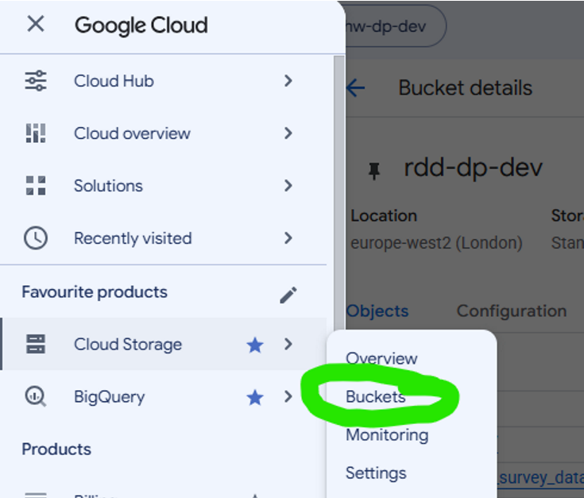
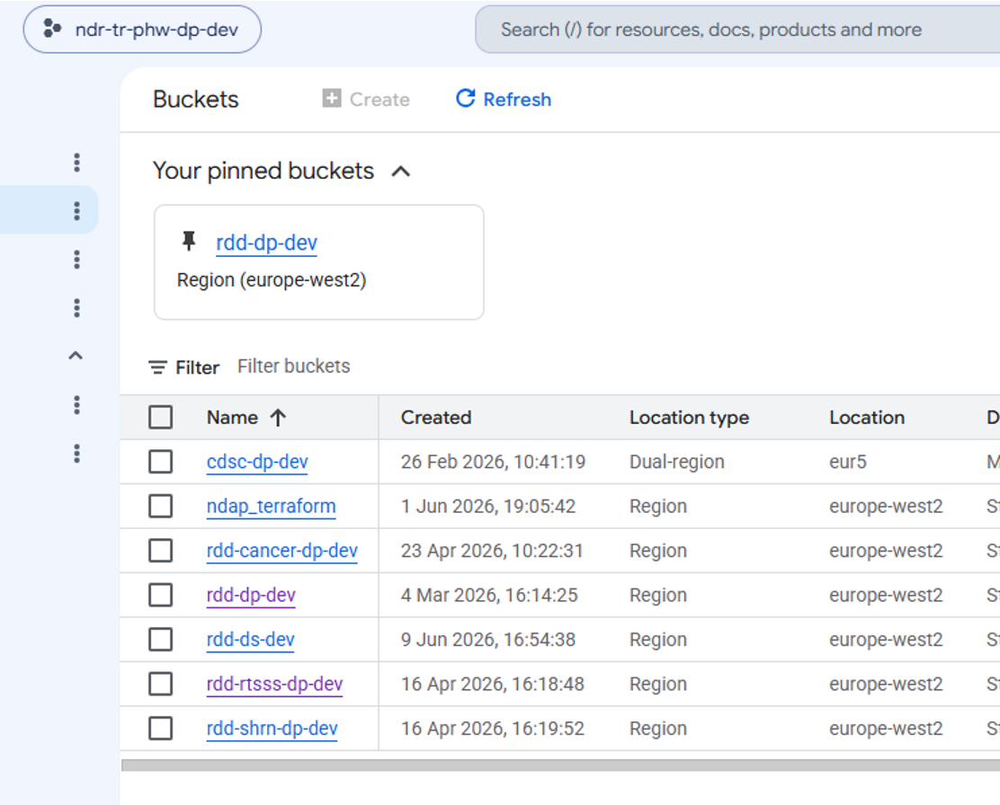
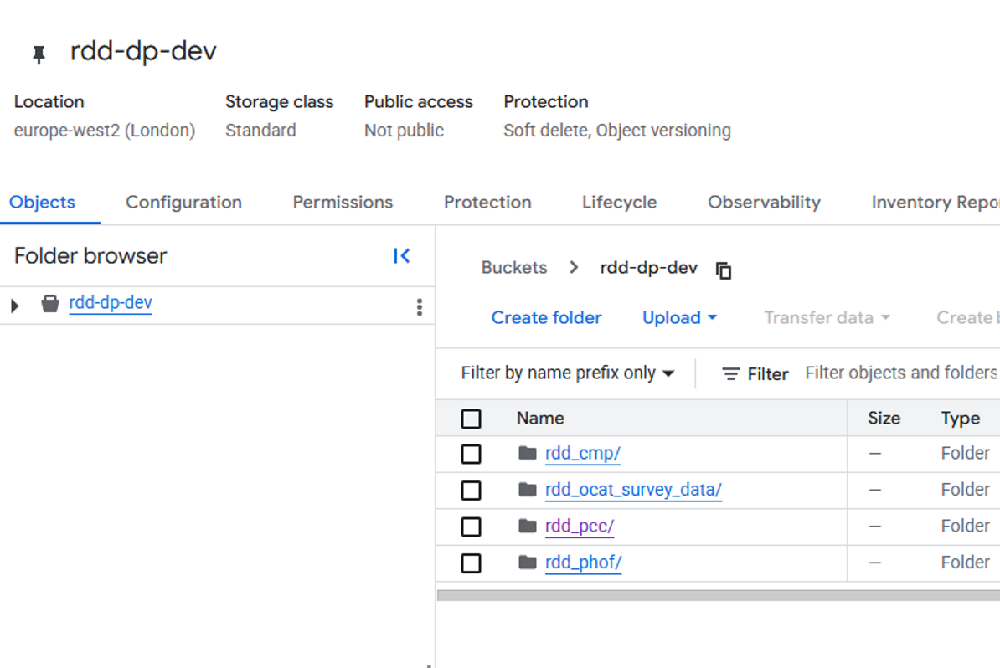
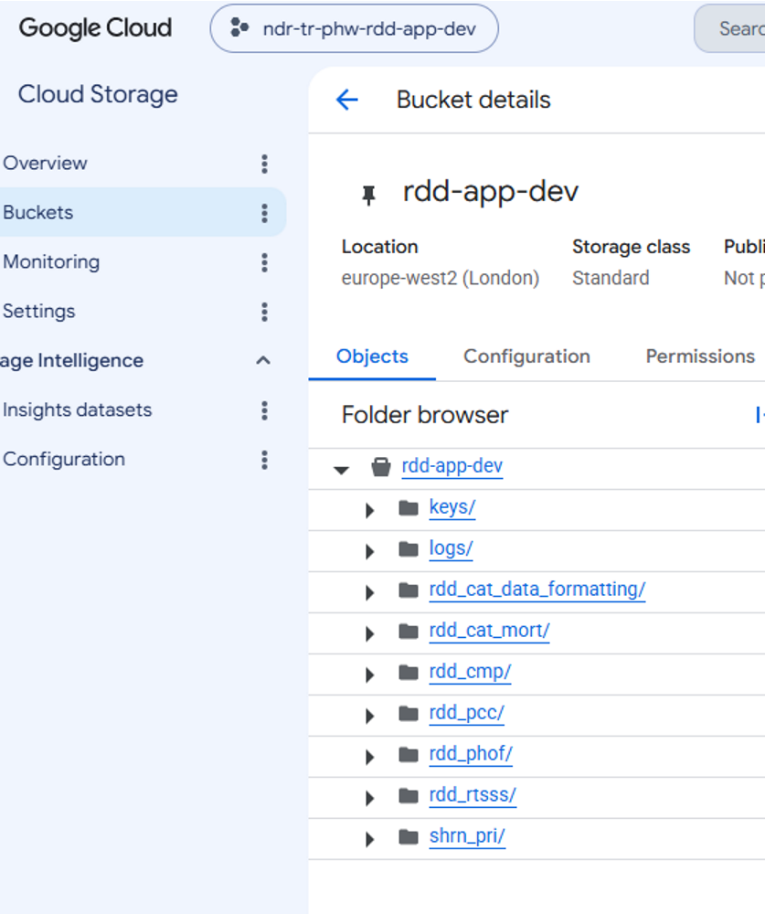
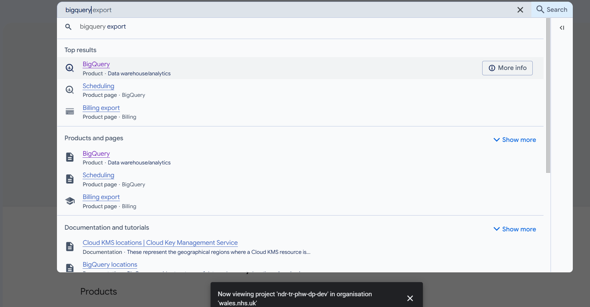
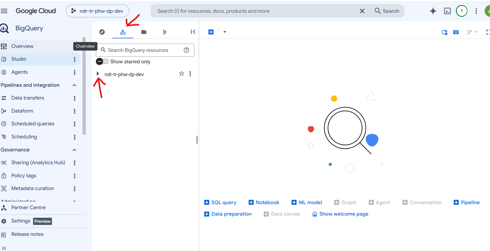
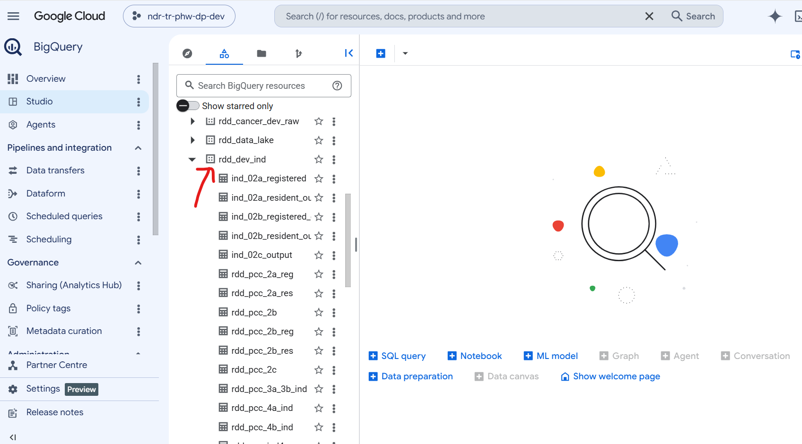
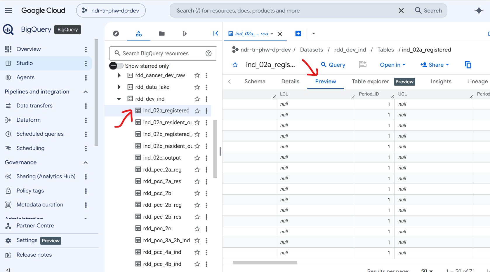
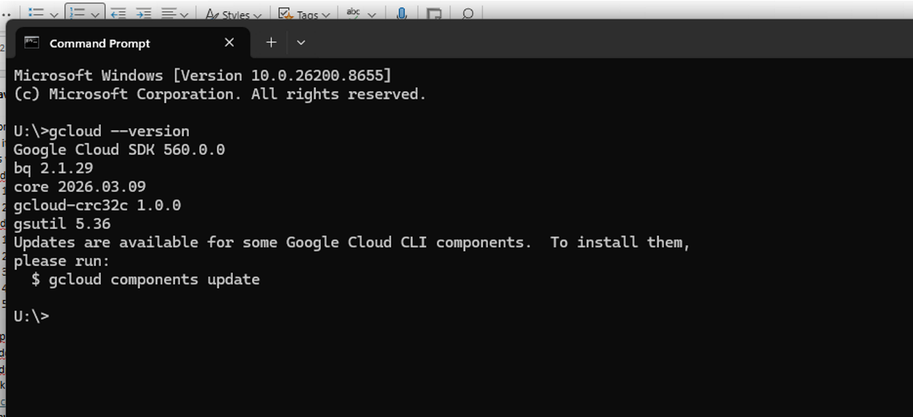
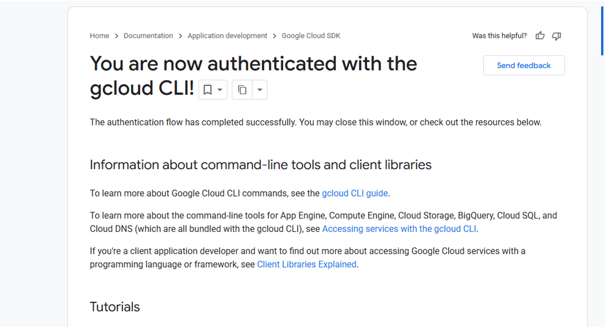

# Introduction to Working in GCP

This page provides a starter guide to setup and connect to GCP from your local system. Since GCP is a remote system, you have to connect to it using a Google provided gateway and authenticate yourself. Please follow the steps below to do that.

# Do I have GCP access?

## Project Access

1. Ensure you have GCP access. Please drop a mail to Service Desk requesting access. Line manager approval is needed.
2. Once done, please connect with NDAP Data Engineering team to be added to appropriate GCP projects and GCS buckets.
3. Projects you will need access to: Please discuss with your team colleagues. If you are unsure, please reach out to NDAP Data Engineering team.
Generally, there are four projects:
  - **Ndr-tr-phw-dp-dev**: This is the development area project which contains data i.e. tables and files
  - **Ndr-tr-phw-dp-prod**: This is the production area project with data.
  - **Ndr-tr-phw-app-dev**: This is the development area project which contains all applications. Your codes will run here.
  - **Ndr-tr-phw-app-prod**: This is the production area project which contains all applications. Your production live codes will run here.
4. Please check if you have access to the projects by clicking on the links below:
  - [dp-dev](https://console.cloud.google.com/welcome/new?project=ndr-tr-phw-dp-dev)
  - [dp-prod](https://console.cloud.google.com/welcome/new?project=ndr-tr-phw-dp-prod)
  - [app-dev](https://console.cloud.google.com/welcome/new?project=ndr-tr-phw-cdsc-app-dev)
  - [app-prod](https://console.cloud.google.com/welcome/new?project=ndr-tr-phw-cdsc-app-prod)

## Data Access

Access to GCP projects may not always give you access to data. Data access is often restricted as per usage requirements so you may need to request for additional access to buckets and tables.

### Bucket Access

1. Check you have access to the right project buckets on Google Cloud Storage. Ensure you are in dp-dev project (or prod) and then navigate to GCS Buckets 

2. You should be able to see a list like below:

3. Click on your team bucket and see if you can see contents. For example, if you click on rdd-dp-dev bucket and you should see more folders:

4. Do the same check for app-dev in GCS:

5. If you get any error message at any point, please reach out to NDAP Data Engineering team.

### Table Access

1. Check you have access to the right BigQuery DataSets. Ensure you are in dp-dev project (or prod) and then navigate to BigQuery 

2. Click on the triangle-type symbol on the middle pane and then expand the ndr-tr-phw-dp-dev:
3. You should be able to see a list like below:

4. Click on your team Dataset and see if you can see list of tables. For example, if you click on rdd-dev-ind dataset, you should be able to see tables under if, if you have access.

5. Click on any table under the dataset, the table details will appear on the pane to the right. Click on the preview tab on right pane, and you should be able to see data in the table.

6. If you get any error message at any point, please reach out to NDAP Data Engineering team.

# Google Cloud SDK: What is it & How do I get it?

Full form of SDK is software development kit. It is a suit of softwares which enables you to authenticate & connect to GCP and run a series of commands from your local machine. 

## Check if you have Google Cloud SDK

1. Open the Command prompt from your taskbar
2. Type in 'gcloud –version' press enter
3. If you have it installed you will see the following: 

4. If you get an error, then you need to contact the Service Desk and request Google SDK install to facilitate GCP working, copy Louisa Nolan in for approval

## Authenticate to GCP

1. Make sure you have Google Cloud SDK installed by following steps mentioned above.
2. Open the command prompt from your taskbar
3. Paste in 'gcloud auth application-default login'
4. The command prompt will run and will automatically open a browser window with your Google login details
5. Click yes to log in with your @wales.nhs.uk email account
6. Click select all on the access prompt
7. You will then see the following screen to confirm authentication with gcloud CLI:

