# How to get access to GitHub & work with it

This page gives an outline of steps needed to gain access to PHW GitHub repositories and how to get comfortable working in GitHub. If you are already aware of the steps, please skip.

## Get Access to GitHub

Please follow the steps mentioned below to create a GitHub ID and to get access to specific repository.

1. Create a GitHub user-id using your wales.nhs.uk email id by following below steps:
  1. Go to www.github.com
  2. Click on 'sign up' and fill up the fields
  3. Please ensure you are using **your wales.nhs.uk email**
2. Once done, you will get a GitHub user-id, mail to Hugo Cosh requesting to be added to PHW organization in Git.
3. Once done, please check with your project lead for the specific repos you will need.
4. Repository list for PHW is here: Public-Health-Wales repositories
5. Please check if you have access by clicking on the links
6. If you do not have access, please mail to NDAP Data Engineering team requesting access. Please mention the following in you mail:
  1. your github userID. To get your userid, please refer to the screenshot below:

  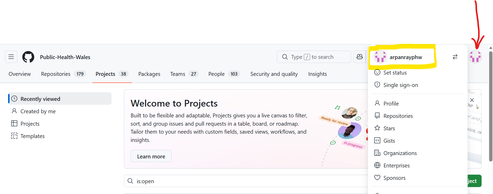

  2. the name of the repository you need to be added to
7. Once Data Engineering team confirms that you have been added to the repo, you may please refer to step 5 to check access

## Working in GitHub

GitHub is a version control service, that maintains your artefacts (code, documents etc) in remote locations (called repositories). These repositories are access controlled to maintain security. It allows you to work in your local, make changes, and sync the changes to the remote repository through secure connections. It maintains version of artefacts (we will call it codes for easy understanding) through something called branches. You can think of branches as snapshots of entire codebase.

### Branching Model in NDAP

In PHW-NDAP, we follow a thre branch model:

- Every repository usually have multiple feature branches. When you want to make any changes, you would want to take a copy of the latest code in your own area (which is called feature branch), make changes, do unit tests, and once done, sync the feature branch changes to remote repo (push the code).

- Next up: Dev branch. Think of it as the place where everyone's changes are merging together, but you still need to check if the whole thing is working before marking it as the final version. So, you raise a request to merge your feature branch to dev branch (this is called a Pull request). This request is usually peer reviewed and then merged. Usually, we do a round of overall testing to ensure everything is in order.

- Finally, a main branch, which is the golden production version of code. Since this is the cleanest and best version of code, making changes to this branch is restricted, and changes can only be pushed here from dev branch. You will not be able to push to main branch directly from feature branch as feature branch may contain untested / brittle code that may break the overall codebase.

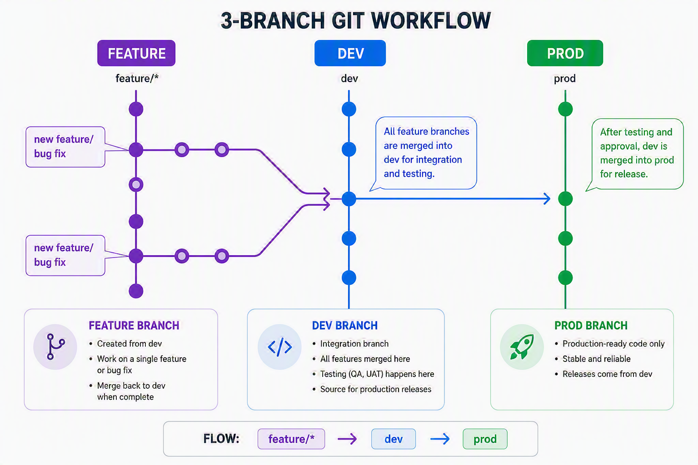

### Quickstart commands in GitHub

To run these commands below, open powershell, type **bash**. It will open a new linux session on your powershell. you can then navigate to the git repository folder on your local machine and run the below commands.

Note: 
- Directories in linux start with /mnt/c/... for C drive etc.
- In windows the directory is C:\System32, and in bash, it will be /mnt/c/System32 . So slashes are different in windows and bash
- if you run git commands from a directory, which does not contain a git repo, it will throw an error

- **clone the repository for the first time to your local system**:

git clone git@github.com:Public-Health-Wales/<repo-name>.git <my-directory>

- **switch to an existing branch**

git checkout <target-branch>

- **create a new branch**

git checkout -b <new-branch>

- **stage your changes**

git add .

- **commit your changes to your local branch**

git commit -m "your commit message goes here"

- **push to the remote version of your branch**
git push

- **push to the remote branch for first time** (usually local and remote branches have same name)

git push --set-upstream origin <name-of-your-branch>

- **check the status of your local branch**

git status

- **To sync your local repo with remote repo**

git pull

### Clone repository: Detailed steps

1. Create a local folder (I used my OneDrive) with the project name e.g. PCC NDAP
2. Right click and open GitBash in that folder
3. Now in GitHub navigate to the repo, in the top RHS of the page there is a green '<> Code' button, click on this then click the copy icon next to the repo web url

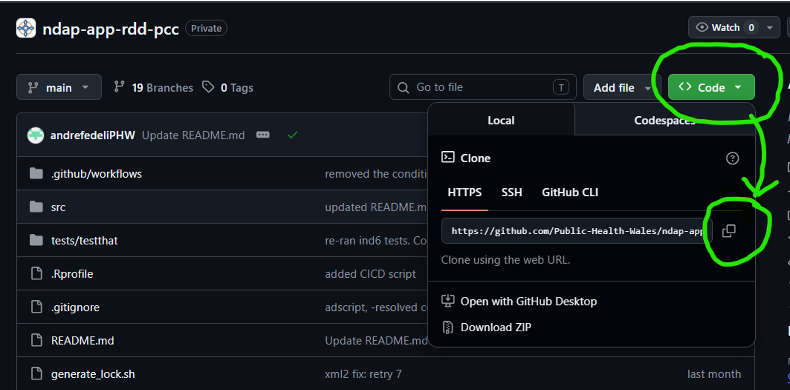

4. Back in GitBash type 'git clone' then right click and paste the url for your repo e.g. 'git clone https://github.com/Public-Health-Wales/ndap-app-rdd-pcc.git'
If you do not specify a target directory then it will clone the repo in your current working directory

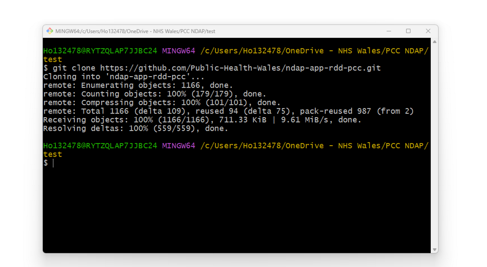

5. Press enter & you should see the repo now appears in your local folder
6. Remember to pull to update your repo

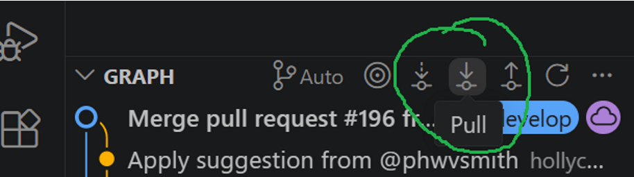

### Branching, commit, push & pull : Detailed steps

This guide takes you through the process of committing a change, making a pull request, merging changes, and pruning the feature branch.

1. Ensure you have loaded the repo in VS code
2. Bottom LHS click **develop**:

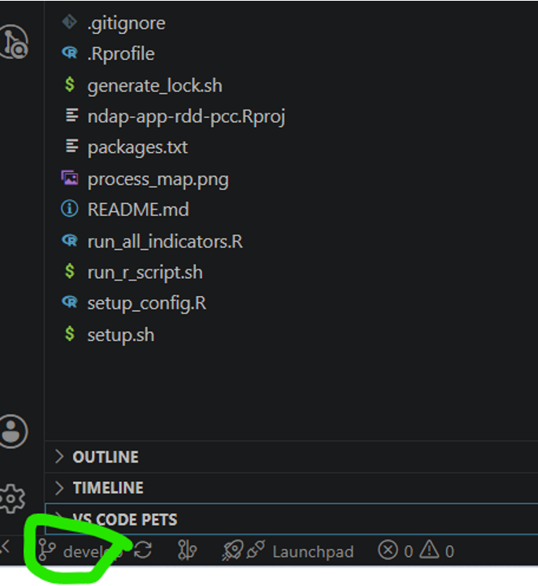

3. Then click **Create new branch** from in top search bar options:

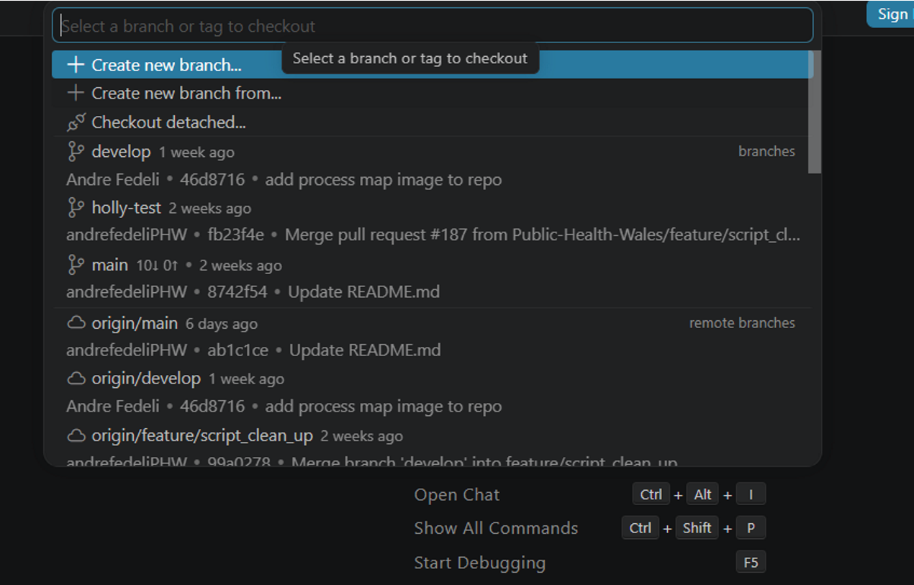

4. Then click **develop** branch
5. Then option to give it a name feature/NAME. 
For example: feature/holly-test-2 & Press **enter**
You are now checked out and working on the new branch

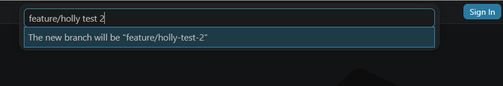

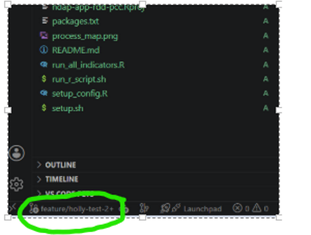

6. Now you can go ahead and edit your script and make your changes. I've made a very simple change to test it.

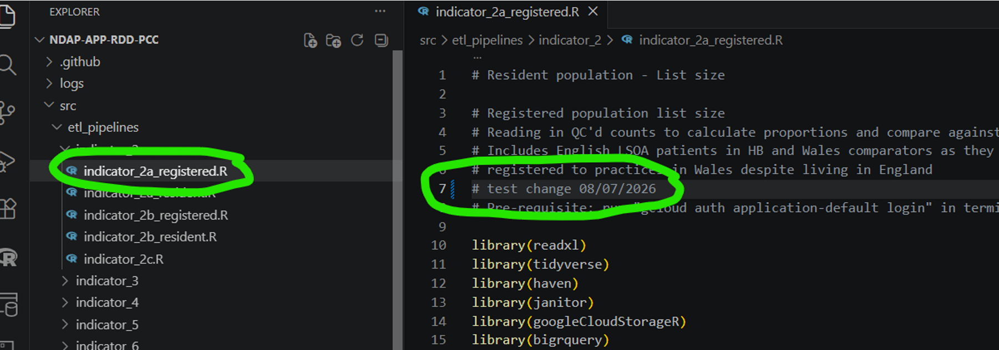

7. Now click the file and then **Save**
8. Go back to little branch icon which, has a 1 to show a change, to open up branches

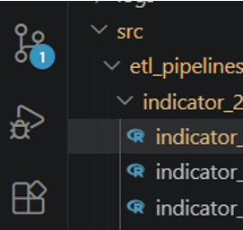

9. Now can see commit button and also you can click on your changes and view them side by side

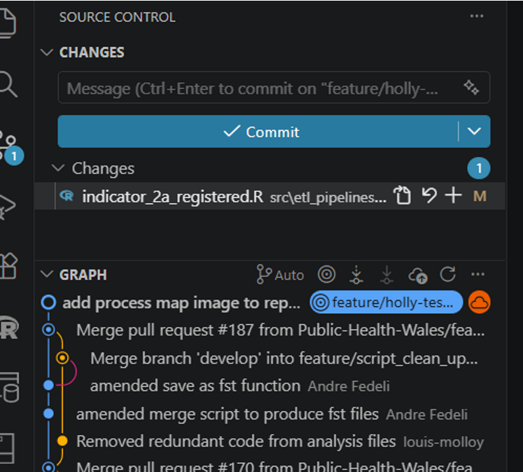

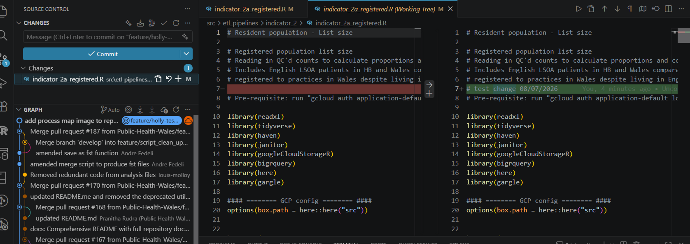

10. Add comment for your commit in the Message box
Then click **commit**
No staged changes - click **Yes**

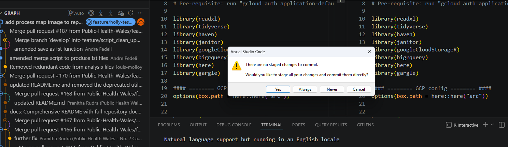

11. you can click the + icon by your change in the script and it then **stages** the change

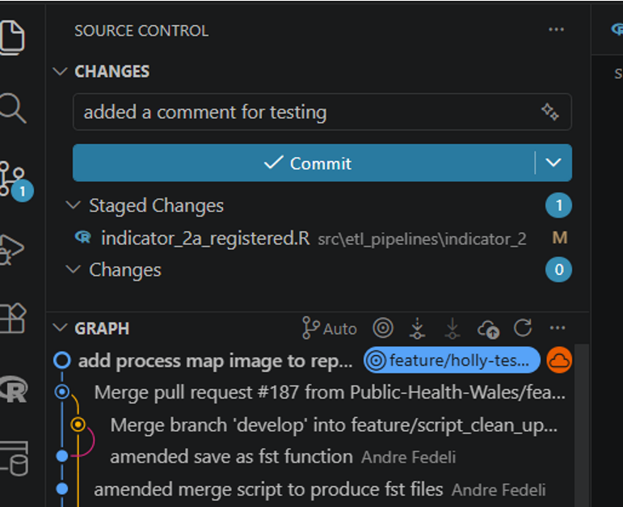

12. You might get this error message when you try to commit:

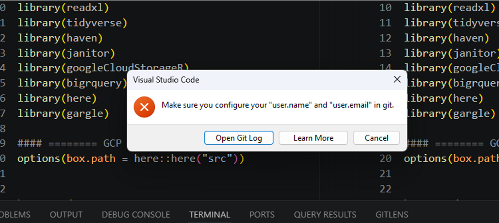

13. In a cmd terminal you need to paste:
  - git config user.name "YOUR NAME"
  - git config user.email "YOUR WORK EMAIL"
And it will be resolved

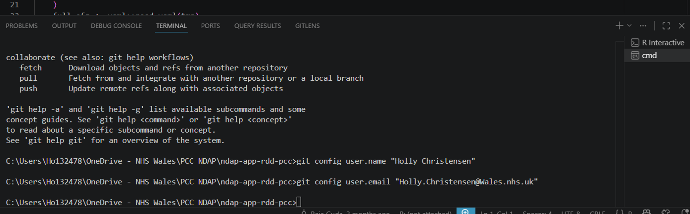

14. Once you have committed the change you will see a change to the commit button will be greyed out.

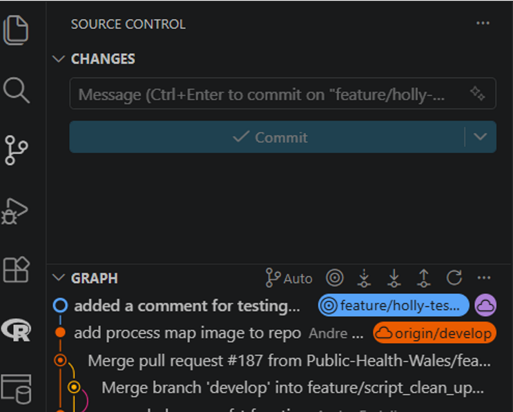

15. You can go and check in github that your commit has been pushed

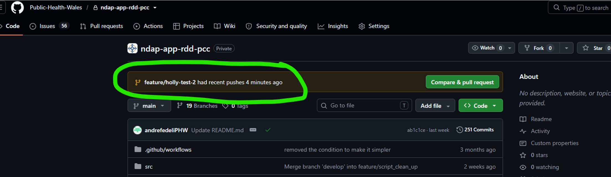

16. Now need to merge changes into develop or get them reviewed by a colleague and then merged
This process is called a pull request.

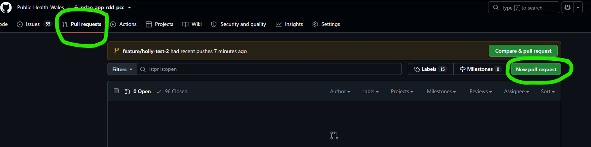

17. Click new pull request
18. Typically you would merge into develop first
  - Select base as **develop** and compare to your branch
  - Now can see your changes in github
  - Title is populated from your commit message
  - Can add description
  - Then click **create pull request**
19. On RHS you can click the settings and add a reviewer for the pull request
20.  The reviewer will see the following screen:

Click **Add your review**
21. The you get the review screen
  - Check line by line
  - Can add in any comments needed
22. If you click the **plus**, you can add any comments or code suggestions
23. Once you have 
  - added your comments/suggestions
  - You click **Start a review**
  - Then you you see this screen
24. Select one of the options to Comment/Approve/Request changes then click **Submit review**
25. Then the requestor will have a pull request to action
26. Then you can click **Apply the suggestion** and **Commit changes**
If there was no suggestion then reviewer would just click **Approve** and then you would click **Merge**
27. Or you can use the **Files changes** tab & Click **Apply suggestion**
28. Reviewer can now approve the commit
29. Look at the pull request, you should see the following:
30. Click ready to merge on RHS, Then **merge pull request**
31. Sign it has merged:
32. If you want you can delete the branch:
33. Your local repo will be resynced when you do a git pull in VS code
  - Change branch back to develop (from your deleted feature branch)
  - Pull
  - You might need to manually delete it locally too
