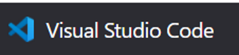
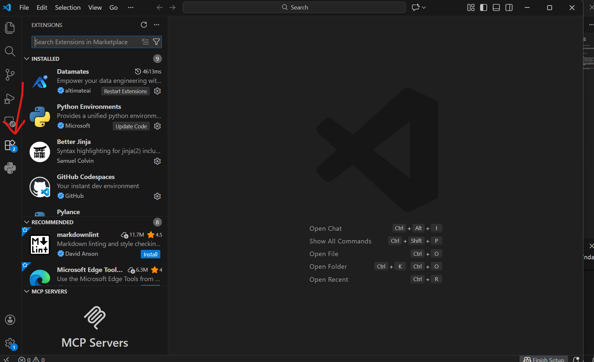
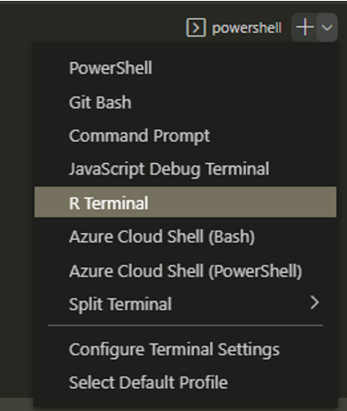
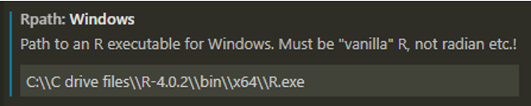
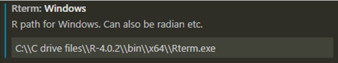

# A Guide to setup and work in VSCode

This document lays out steps on how to setup VSCode and execute R code from VSCode

## VSCode: What is it?

Visual Studio Code is a code editor (produced by Microsoft) which can handle a number of different coding languages (R, python, markdown, HTML and CSS, java) - different to RStudio therefore which only handles R.

   

   https://code.visualstudio.com/ 

VS Code also has Git commands built-in and a user-friendly interface for Git.

## How To Setup VSCode to run R files: Overview

This section is a overview steps required to run R files in VS Code:

1. Install two extensions in VS Code (extensions are the VS Code equivalent of 'packages' in R);
2. Install two packages in R: 'languageserver', 'httpgd'; install the packages into the library of the version of R that you want to use in VS Code.
3. Install 'radian' in VS Code (via a terminal window in VS Code). Radian provides a modern R console that corrects many limitations of the official R terminal and supports many features such as syntax highlighting and auto-completion.
4. Install pandoc for Windows (in order to run/knit R Markdown files; this can be done without admin permissions);
5. Check which version of R is being picked up by VS Code - you may want to specify which version of R to use in VS Code (if you have more than one version of R installed on your system/profile).
6. To specify which version of R to use in VS Code see the instructions here [Changing R version in VS Code - Stack Overflow](https://stackoverflow.com/questions/72707869/changing-r-version-in-vs-code)

## How To Setup VSCode to run R files: Detailed Steps

1. **VS Code extensions**: To install extensions in VS Code, navigate to the Extensions tab in the LH navigation menu, and search for the required extension. Then click on 'Install'.

    

   - **R Extension for Visual Studio Code** - [see background details](https://marketplace.visualstudio.com/items?itemName=Ikuyadeu.r)
   - **R Debugger** - to support R debugging capabilities
2. Install radian – in a PowerShell terminal in VS Code, run the command **pip install -U radian**
3. **R packages**:
   - Open RStudio, and install the packages into the version of R that you want to use in VS Code. You can also install packages via an R terminal in VS Code.
   - Install **languageserver** and **httpd**
4. **Install pandoc for Windows**:
   - [pandoc install](https://pandoc.org/installing.html) Go to this page, and click on the **Download the latest installer for Windows (64-bit)** button. You will probably get an IT alert about the filetype, but you have the option to click **Progress** to continue with the download. Run the installer file when it is downloaded.
   - To check that VS Code can find the pandoc installation, open VS Code (or restart VC Code if you had it open whilst installing pandoc), open an R terminal, and run the command **rmarkdown::find_pandoc()**
5. Check which version of R is being picked up by VS Code:

   

The default intro text will display the version of R being used.
6. To manually amend the path to the R version that you want to use, in VS Code, open Settings | Extensions, then scroll down to the options for the R extension. Add the path to the R.exe file into the [Rpath: Windows] box, and the path to the Rterm.exe file into the [Rterm: Windows] box.

   

   

## Further Guidance
For further guidance, please check [here](https://www.r-bloggers.com/2021/01/setup-visual-studio-code-to-run-r-on-vscode-2021/)

